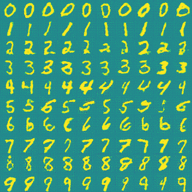
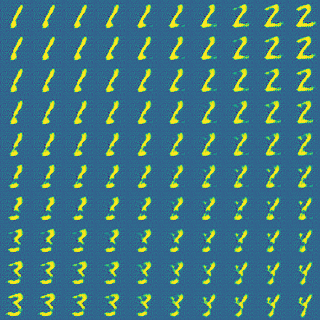

# GAN
the popular generative adversarial network for generating images based on a training data with python and tensorflow.

## Description of each file:

* [**Databases**](Databases/): here you should store the training data. for this project I have used MNIST dataset available in [here](http://makeyourownneuralnetwork.blogspot.nl/2015/03/the-mnist-dataset-of-handwitten-digits.html) and CelebA dataset thet you can find in [here](http://mmlab.ie.cuhk.edu.hk/projects/CelebA.html). although you can put your own data on a subfolder of this folder and then you can pass the dataset path to the GAN you want to be trained.

* [**GAN.py**](GAN.py): implementation of the class of GAN. that you can feed a dataset and set a configuration for a GAN and you can train it or extract results.

* [**MNIST_Main.py**](MNIST_Main.py): main code for training a GAN based on the MNIST dataset and then visualizing the results of the trained GAN.

* [**MNIST_Visualization.py**](MNIST_Visualization.py): some functions that are used for visualization of MNIST GAN.

* [**CelebA_Main.py**](CelebA_Main.py): main code for training a GAN based on CelebA dataset and then visualizing the results of the trained GAN.

* [**CelebA_Visualization.py**](CelebA_Visualization.py): some functions that are used for visualization of CelebA GAN.

* [**CelebA_Visualization_Form.py**](CelebA_Visualization_Form.py): class of a UI form for generating a face by setting it's **z** values.

## Details

first of all you should download a train dataset and put it on a [Databases](Databases/) subfolder. for example I have used MNIST-csv and CelebA datasets that are available [here](http://makeyourownneuralnetwork.blogspot.nl/2015/03/the-mnist-dataset-of-handwitten-digits.html) and [here](http://mmlab.ie.cuhk.edu.hk/projects/CelebA.html) respectively. Note that in the img_aligned_celeba folder you should have about 200000 images and in the MNIST folder you should have two csv files (mnist_train.csv and mnist_test.csv).
 
if you take a look at [GAN.py](GAN.py) you can see it's a class with some functions. in the constructor, the neural network model is built using generator and discriminator. here I've used a **Deep-Convolutional-GAN** and you can set the parameters for convolutional layers when you create your GAN. also if your data has target, and you want to generate images for each target class, you can feed it to your GAN object while creating it. thus this target should have shape **[NUM_DATA, NUM_CLASSES]**, each row is a one-hot vector identifying a class. for example **MNIST-GAN** is of this case. the GAN object creates an **Conditional-GAN** in constructor if you feed a target to it.
 
after creating the GAN object, it's time to train it using train function where you can set the parameters like **batch_size** and **learning_rate**. if you set **verbose** equal to 1, then you can see some results and some generated examples after each epoch. for training process I have used **ADAM OPTIMIZER** for both generator and discriminator with **beta1 = 0.5**. also you can see all of my parameters for training **GAN-MNIST** and **GAN-CelebA** form [MNIST_Main.py](MNIST_Main.py) and [CelebA_Main.py](CelebA_Main.py).
you can save the trained model by **GAN.save()** function, and also load a trained model by **GAN.load()** function. 
 

## Reuslts

### MNIST

| |  | 
|:--:| 
| *table of generated numbers* |

|  | 
|:--:| 
| *translation table for 1, 2, 3, 4* | |
