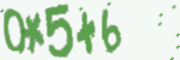
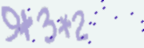
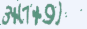

# OCR
converting image to text using convolutional and recurrent layers by optimizing a ctc loss with python and tensorflow.

## Description of each file:

* [**Datasets**](Datasets/): the folder that should store the training dataset. for this project we have used 100k images with labels for some competition, but now the competition page in unavailable. you should download it from [Here](https://github.com/watsonyanghx/CNN_LSTM_CTC_Tensorflow/issues/2), then extract the training data in **Datasets/image_set_train**.

* [**PaintedImages**](PaintedImages/): folder that contains painted images and labels. you should add image with **Paint.py** and then predict them.

* [**Models**](Models/): the folder for saving the generated tensorflow models.

* [**data.py**](data.py): contains some functions related to data, like reading data and generating batch for training.

* [**train.py**](train.py): code for building the tensorflow model and then saving it.

* [**Predict.py**](Predict.py): for restoring the saved tensorflow model and the function for predicting images.

* [**Paint.py**](Paint.py): the code for drawing images and saving it to **PaintedImages** folder then you build your own dataset and then also you can predict them.

* [**main.py**](main.py): for computing result for train and validation datasets. for example computing accuracy.

## Details:

as I mentioned above, first you shoud download the training data from [Here](https://github.com/watsonyanghx/CNN_LSTM_CTC_Tensorflow/issues/2) and then extract it to **Datasets/image_set_train**. so the **Datasets** folder should contains **image_set_train** folder. and in that folder you should have 100,000 png images and a text file named **labels.txt** that has the target data.  
some images from the data:  

 
after that you are able to run the **train.py** code. at the begining of the code, the data is being read and it's being extracted to input images, targets and sequence lengths so we can use it for train. also I considered 70% of data for train and 30% for validation.
after that the images will be going to convolution layers. I constructed 4 convolution layers and each layer has also a **leaky_relu** activation function, a **batch_normalization** section and a **maxpool** layer in it.
you can see that maximum length of data is 7 so our last convolution layer size is 7.
more general, convolution sizes is [64, 128, 128, 7] each of them has 3×3 kernel.
 
the next section is recurrent section. here I used a dynamic rnn with 2 layer lstm cells with 64 nodes, I set the keep_prob to 1 because the data is big enough to avoid overfitting.
 
in the end we can extract 7 tensors from output of dynamic rnn for each position of the sequence. then I used a linear with softmax activation for each of 7 tensors so we can make the prediction result. (remember we have 15 classes and with blank class we have 16 classes).
  after that we pass the predictions to a **CTC_Loss** and we use an **Adam Optimizer** for optimizing.
 
for training section I used batch_size=30 and learning_rate=0.01.
   
if you have **tkinter** installed then you can run the **Paint.py** code and you will see a window where you can draw your own image and write the target text in the textbox then by pressing the save button your generated data will save to **PaintedImages** folder.
 
**Predict.py** is the code that contains a function for predicting images and it gives you also the confidence of true predicting for each image. so if you run **main.py** you can see the results for train and validation data.  
with this model I could achive to these results:  
**Train Accuracy = 95%**  
**Validation Accuracy = 94.2%**  
**Mean Confidence for Correct Predictions :  for Train=96.7% , for Validation=96.6%**  
**Mean Confidence for Incorrect Predictions : for Train=74.8% , for Validation=74.9%**  

